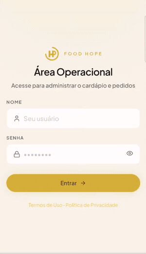
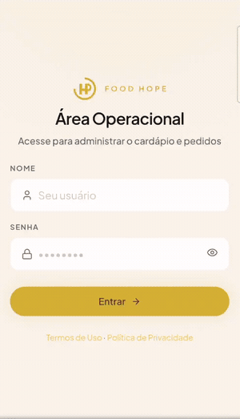

# Food Hope

Plataforma de pedidos para restaurante/lanchonete: um cardápio digital para o cliente e um painel de gestão para a equipe, com impressão automática de comandas na impressora térmica.

## Propósito

Centralizar o fluxo de venda em um só lugar:

- **Cliente**: navega o cardápio no celular, monta o carrinho (com adicionais) e finaliza o pedido.
- **Operador**: acompanha os pedidos em tempo real e gerencia o cardápio.
- **Admin**: além do acima, vê o dashboard/relatórios, configura a impressora e gerencia usuários.
- **Totem**: modo quiosque para o próprio cliente fazer o pedido no local.

Cada pedido novo cai no painel via socket em tempo real e pode ser impresso direto na impressora térmica (ESC/POS).

## Apresentação

Demonstração da plataforma em uso:






## Stack

- **API** (`api/`): NestJS + Prisma + PostgreSQL, Redis/BullMQ, autenticação JWT, WebSocket (Socket.IO) e impressão térmica ESC/POS.
- **Web** (`web/`): Vite + React + Tailwind CSS v4, React Query, Zustand e Recharts.
- **Infra** (`docker/`): Docker Compose (postgres, redis, api, web) e Cloudflare Tunnel para exposição HTTPS.

## Estrutura

```
foodhope/
├── api/      # backend NestJS + Prisma
├── web/      # frontend React (cliente + painel)
└── docker/   # docker-compose e variáveis de ambiente
```

## Rodando com Docker

```bash
cd docker
cp .env.example .env   # ajuste as variáveis
docker compose up -d
```

A API sobe na porta `5000` e o web na porta `80` (configuráveis no `.env`).

## Desenvolvimento local

```bash
# API
cd api && npm install && npm run start:dev

# Web
cd web && npm install && npm run dev
```
